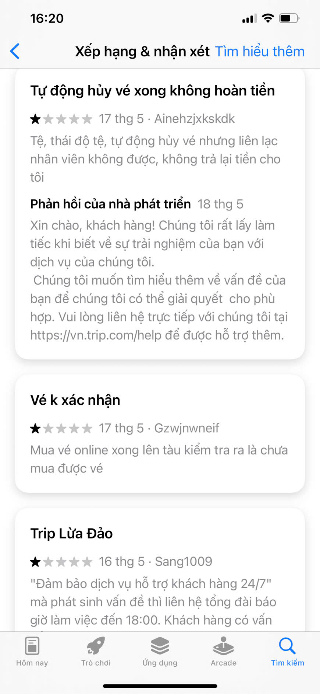
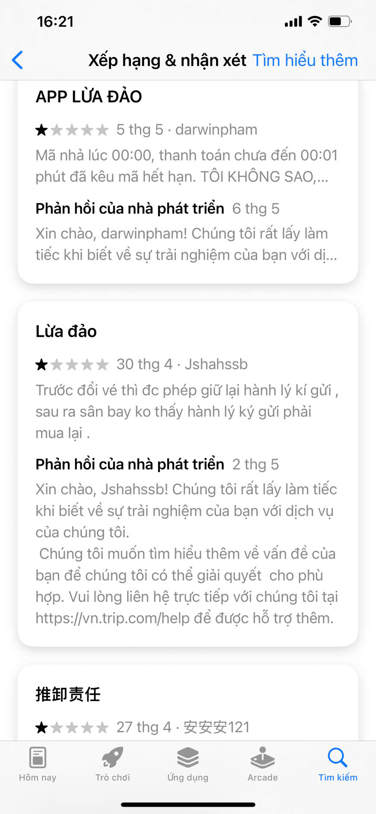
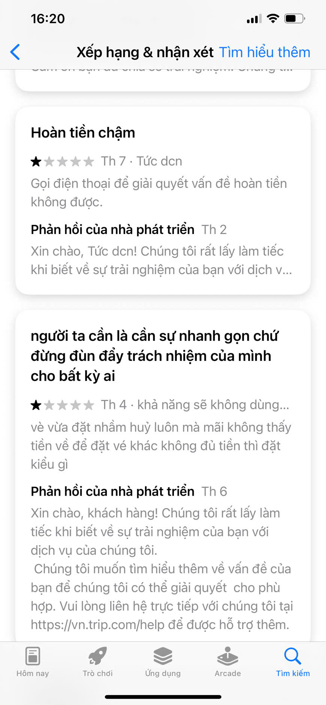

# Evidence Pack — Track B: Travel & Hospitality

Nộp kèm thin SPEC cuối Day 05.

## 1. Nhóm và track

**Tên nhóm:** Nhóm 16383
**Track:** B. Travel & Hospitality
**Product/app đã chọn:** Trip.com (OTA platform)
**Build slice đang nghĩ:** AI Crisis Copilot - Tự động xử lý khủng hoảng (hủy vé, lỗi mã) và định tuyến ưu tiên hỗ trợ khẩn cấp.

## 2. Self-use evidence

Nhóm tự dùng app/workflow và ghi lại điểm gãy.

| Observation | Screenshot/link | Path liên quan | Điều học được |
|---|---|---|---|
| Cố gắng liên hệ tổng đài sau 18:00 khi gặp lỗi thanh toán thì chỉ nhận được tin nhắn tự động bảo chờ đến sáng. |  | Failure Path | Lời hứa "Hỗ trợ 24/7" trên app là không có thật đối với các case phức tạp. User bị chặn luồng hoàn toàn. |
| Chatbot hiện tại chỉ biết xin lỗi bằng văn mẫu khi hệ thống báo lỗi không áp dụng được mã dù mới 00:01. |  | Low-confidence / Failure | Bot dùng kịch bản cứng (rule-based) nên không xoa dịu được user, ngược lại làm họ tức điên vì cảm giác bị "bot lừa". |

## 3. User / review / social evidence

Nguồn có thể là review App Store/Play, group, comment, phỏng vấn nhanh, hoặc nguồn public khác.

| Quote / review / observation | Nguồn | User là ai? | Pain/failure mode |
|---|---|---|---|
| "Tự động hủy vé xong không hoàn tiền... liên lạc nhân viên không được" | App Store Review (Trip.com)<br> | Khách hàng đã thanh toán xong | Bị hủy dịch vụ đột ngột (system fail) nhưng không được hoàn tiền tự động, mất quyền kiểm soát (loss of agency). |
| "Đảm bảo hỗ trợ 24/7 mà phát sinh vấn đề thì liên hệ tổng đài báo giờ làm việc đến 18:00" | App Store Review<br> | Khách hàng cần hỗ trợ gấp (ngoài giờ) | Bị lừa dối về dịch vụ (Promise vs Reality gap), hoảng loạn khi có sự cố. |
| "Đổi vé được giữ hành lý ký gửi, sau ra sân bay không thấy hành lý phải mua lại" | App Store Review<br> | Khách hàng thay đổi lịch trình | Chính sách mập mờ, mất thông tin khi thay đổi booking, dẫn đến tổn thất tài chính thực tế. |
| "Mã nhà lúc 00:00, thanh toán chưa đến 00:01 phút đã kêu mã hết hạn. LỪA ĐẢO" | App Store Review<br> | User săn sale | Lỗi logic hệ thống gây ức chế tột độ. |
| "Người ta cần là cần sự nhanh gọn... vừa đặt nhầm huỷ luôn mà mãi không thấy tiền về" | App Store Review<br> | Khách chờ hoàn tiền | Khủng hoảng niềm tin do tổng đài từ chối xử lý, tiền bị giam quá lâu. |

## 4. Competitor / analog evidence

| App / mô hình tham khảo | Họ xử lý task này thế nào? | Pattern học được | Có áp dụng trong 1 ngày không? |
|---|---|---|---|
| Agoda / Booking.com | Cung cấp nút "Request Refund" và tự động duyệt nếu thuộc lỗi từ phía đối tác/hệ thống, có đường dây nóng riêng cho khách check-in trong vòng 24h. | Phân luồng ưu tiên: Khách sắp bay/check-in được kết nối thẳng với người thật hoặc Auto-refund không cần đợi. | Có. AI phân tích thời gian và mức độ nghiêm trọng để quyết định cho Auto-refund hay chuyển Human Agent. |

## 5. Evidence -> Insight

```text
Evidence nổi bật nhất:
Hàng loạt review 1 sao phẫn nộ gọi app là "Lừa đảo", "Không liên lạc được nhân viên" khi gặp sự cố trừ tiền/hủy vé/mất hành lý.

Insight:
User OTA không chỉ gặp lỗi bề mặt (surface problem) là trục trặc hệ thống.
Thật ra họ cần một "chiếc phao cứu sinh" tức thời (Recovery & Trust),
vì các bằng chứng cho thấy khi gặp sự cố sát giờ hoặc mất tiền oan, sự im lặng hoặc đùn đẩy của Chatbot khiến họ cảm thấy bị lừa dối.

Opportunity:
Cơ hội là dùng AI để tự động chẩn đoán lỗi (dựa trên context giao dịch),
giúp user giải thích minh bạch nguyên nhân và tự động bồi hoàn/định tuyến khẩn cấp,
trong khi vẫn kiểm soát rủi ro bằng cách chuyển cho Human Agent đối với các case không xác định rõ lỗi hệ thống.
```

## 6. Evidence đổi SPEC như thế nào?

- [x] Đổi user chính.
- [x] Đổi pain statement.
- [x] Đổi build slice.
- [x] Đổi Auto/Aug decision.
- [ ] Đổi 4 paths.
- [x] Đổi failure mode.
- [ ] Đổi owner/test plan.

Ghi rõ 1-2 thay đổi quan trọng:

```text
Trước evidence, nhóm định: Làm AI Chatbot gợi ý lịch trình du lịch (Concierge) cho người đang lên kế hoạch.
Sau evidence, nhóm đổi thành: Làm AI Crisis Copilot để tự động giải quyết các case bị hủy vé/mất tiền oan/lỗi chính sách cho user đang hoảng loạn.
Lý do: Vấn đề lịch trình là nice-to-have, còn khủng hoảng booking là pain-point rỉ máu (must-have) dẫn đến việc người dùng tẩy chay/xóa app diện rộng.
```
